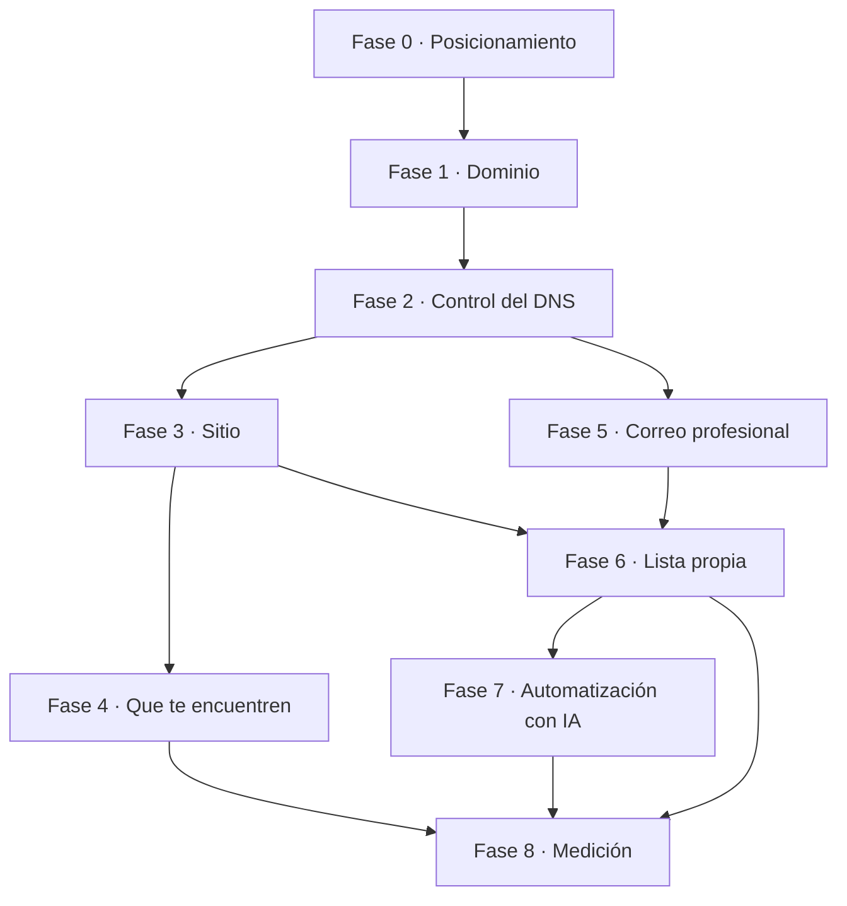

# Playbook: crea tu marca digital y vende más

Guía de fases para llevar a un profesional independiente desde "tengo un oficio y un
Gmail" hasta "tengo una marca digital que capta, atiende y vende sola".

**Este documento es un mapa, no un manual de clics.** Las herramientas cambian: Google
Workspace rediseña su consola, Cloudflare mueve un botón, Vercel renombra un plan. Un
manual de clics muere en seis meses. Lo que no cambia es el **orden de las decisiones** y
**cómo saber que un paso quedó bien hecho**. Eso es lo que está aquí.

Cada fase trae:

- **Qué estás haciendo y por qué** — el concepto, que es lo que no caduca
- **Decisiones** — lo que hay que resolver, con criterio para elegir
- **Cómo verificar** — la señal objetiva de que quedó, no "se ve bien"
- **Trampas** — errores que cuestan dinero o tiempo, salidos de haberlo hecho de verdad
- **Costo** — aproximado, verifícalo siempre
- **Pregúntale a un LLM** — el prompt exacto para resolver el "cómo" del momento

> **Sobre los precios:** son estimados de referencia y cambian seguido. Trátalos como
> orden de magnitud para presupuestar, no como cotización. Verifica antes de prometerle
> un número a un cliente.

---

## El mapa completo

La dependencia que más se subestima: **el control del DNS bloquea todo lo demás.** Sitio,
correo, verificaciones de terceros, todo cuelga de ahí. Si el cliente no te da acceso al
DNS, el proyecto no arranca — negocia eso antes de cobrar el anticipo.

---

## Fase 0 · Posicionamiento (antes de gastar un peso)

### Qué estás haciendo y por qué

Decidir **qué frase quieres poseer**. No "quiero un sitio bonito", sino: cuando alguien
busque *esto* en Google o se lo pregunte a una IA, quiero salir yo.

Esta fase parece blanda y es la que más rinde. Un sitio precioso sobre un posicionamiento
confuso no vende. Un sitio feo sobre un posicionamiento filoso sí. Y el nombre del dominio
sale de aquí, no al revés — comprar el dominio primero es el error de orden más común.

### Decisiones

**A quién le hablas.** Uno, no cuatro. Con nombre, edad, en qué trabaja, qué le quita el
sueño a las 11 de la noche. Si no puedes nombrar a una persona real que ya te haya dicho
esa frase, todavía no lo tienes.

**Qué frase quieres poseer.** Tres a cinco palabras. Debe ser algo que la gente
efectivamente busque, no como te gustaría que te describieran. Diferencia entre
"transformación digital contable" (nadie lo busca) y "contador que sabe de IA" (sí).

**Qué prueba tienes.** Un caso real con números vende más que diez adjetivos. Piensa: ¿qué
hiciste que suene imposible y sea verificable?

**Colisión de marca.** Si ya tienes una empresa o producto, define qué vive en cuál. Marca
personal y marca de producto compiten por las mismas búsquedas si no las separas a
propósito. Regla útil: la marca personal se queda con **quién eres y qué sabes**; la marca
de producto con **qué se compra**.

### Cómo verificar

Puedes completar estas tres frases sin titubear:

1. Ayudo a `[persona específica]` a `[resultado concreto]`
2. Cuando alguien busca `[frase]`, quiero salir yo
3. La prueba de que puedo es `[caso con números]`

### Trampas

**Elegir el dominio antes del posicionamiento.** Te amarras a un nombre que en tres
semanas ya no describe lo que vendes.

**Hablarle a todos.** "Servicios contables integrales" no le habla a nadie. El miedo a
excluir es lo que produce sitios invisibles.

**Confundir lo que sabes hacer con lo que la gente compra.** La gente no compra "dominio de
Excel avanzado"; compra "que se me acabe el domingo de cerrar la nómina".

### Costo

**$0.** Es la fase más barata y la que decide el retorno de todas las demás.

### Pregúntale a un LLM

> Soy `[oficio]` y quiero posicionarme en `[nicho]`. Estas son las tres cosas que he hecho
> de las que estoy más orgulloso: `[...]`. Ayúdame a encontrar la frase de 3 a 5 palabras
> que debería poseer en búsquedas, y dime si la gente realmente busca eso o me la estoy
> inventando. Cuestióname.

---

## Fase 1 · El dominio

### Qué estás haciendo y por qué

Comprando **el único activo verdaderamente tuyo** de todo este sistema.

Piénsalo así: el sitio lo puedes rehacer, la plataforma de correo la puedes cambiar, las
redes sociales las rentas y te las pueden quitar. El dominio es lo único que te pertenece y
lo único que hace que todo lo demás sea reemplazable sin perder audiencia. Por eso vale la
pena pagarlo aunque todo lo demás lo montes en capas gratis.

### Decisiones

**El nombre.** Corto, decible en voz alta por teléfono sin deletrear, sin guiones, sin
números. Prueba real: dilo al teléfono y pide que lo escriban. Si fallan, cámbialo.

**La extensión.** `.com` sigue siendo el default de confianza. Las alternativas
(`.mx`, `.ai`, `.co`) funcionan si refuerzan el mensaje — pero cuidado con las extensiones
baratas de reputación dudosa (`.xyz`, `.top`, `.click`): algunos filtros de correo las
castigan de entrada, y vas a pelear contra eso para siempre.

**Dónde lo registras.** Cualquier registrar serio sirve. Lo que importa es que te deje
cambiar los nameservers (todos lo hacen) y que no te cobre de más por la privacidad WHOIS.

**Privacidad WHOIS.** Enciéndela. Sin ella, tu nombre, dirección y teléfono quedan
públicos y te llenan de spam.

**Renovación automática.** Enciéndela y ponle una tarjeta que no venza pronto. Perder el
dominio por un cobro fallido es un desastre recuperable sólo a veces, y caro.

### Cómo verificar

- El dominio aparece a tu nombre en el registrar, con auto-renovación activa
- Un `whois` muestra la privacidad activada
- Anotaste la fecha de expiración en un calendario, aparte del recordatorio del registrar

### Trampas

**Comprar el paquete completo del registrar.** Te van a querer vender hosting, correo, SSL
y "protección de marca". No necesitas nada de eso: el hosting y el correo los vas a montar
mejor y más barato en las fases siguientes.

**Un dominio recién comprado no tiene reputación.** Esto importa muchísimo en la Fase 6:
los filtros de spam desconfían de dominios nuevos por semanas. Compra el dominio temprano
aunque el sitio tarde; la antigüedad se acumula sola y sin costo.

### Costo

| Extensión | Aproximado por año |
|---|---|
| `.com`, `.net` | $10 – $20 USD |
| `.mx` | $20 – $40 USD |
| `.co`, `.io` | $30 – $60 USD |
| `.ai` | $70 – $110 USD |

Añade la renovación: algunos registrars enganchan con el primer año barato y renuevan al
triple. Revisa el **precio de renovación**, no el de alta.

---

## Fase 2 · El control del DNS

### Qué estás haciendo y por qué

Poniendo el **tablero de control** del dominio en un lugar que sirva, y separándolo del
lugar donde lo compraste.

El DNS es la libreta de direcciones de tu dominio: dice dónde vive el sitio, a qué servidor
llega el correo, y prueba ante terceros que el dominio es tuyo. Todo lo que sigue en este
playbook se configura aquí. Los registrars suelen tener paneles de DNS lentos y limitados;
mover el DNS a un proveedor dedicado es gratis y te ahorra fricción en cada fase posterior.

**Concepto clave:** el registrar es *dónde compraste* el dominio; el DNS es *quién contesta
las preguntas* sobre él. Son cosas separables, y conviene separarlas.

### Decisiones

**Quién maneja tu DNS.** Un proveedor dedicado con plan gratuito. Lo que buscas: que sea
rápido, que te deje editar todos los tipos de registro sin límite, y que no cobre por
consultas.

**Proxy sí o no.** Algunos proveedores pueden pasar el tráfico por su red (ocultando la IP
real y añadiendo caché) o sólo responder la dirección y hacerse a un lado. Regla práctica:

- **Registros de sitio web**: el proxy suele ayudar (caché, protección)
- **Registros de correo y de verificación**: **nunca** proxy. Los MX y los TXT/CNAME de
  verificación tienen que ser visibles tal cual, o nada funciona

Esta distinción es responsable de una fracción enorme de los "no me funciona y no sé por
qué" en esta fase.

**Cuando migres el DNS, mete los registros a mano.** La importación automática arrastra
basura del registrar (registros de parking, correo que no usas) que después te causa
conflictos difíciles de diagnosticar. Un dominio nuevo no tiene nada que rescatar.

### Cómo verificar

- Un `whois` del dominio muestra los nameservers de tu proveedor nuevo
- Consultar el dominio desde una red distinta a la tuya devuelve lo que esperas
- No quedaron registros que no reconoces

La propagación tarda de minutos a horas. No es instantánea y no se acelera; lo que sí
puedes hacer es consultar directo a los servidores autoritativos para ver el estado real
sin esperar a que expire el caché.

### Trampas

**Cambiar nameservers antes de haber recreado los registros.** Si el dominio ya tenía
correo funcionando, el correo se cae en el instante del cambio. Primero recreas todo en el
proveedor nuevo, después cambias los nameservers.

**Diagnosticar con caché sucio.** Si consultaste un registro antes de crearlo, tu resolver
guardó el "no existe" y te lo va a repetir un rato aunque ya esté. Consulta directo al
autoritativo antes de concluir que algo falló.

### Costo

**$0.** Los planes gratuitos de DNS cubren de sobra a cualquier negocio de este tamaño.

### Pregúntale a un LLM

> Tengo el dominio `[dominio]` registrado en `[registrar]` y quiero mover el DNS a
> `[proveedor]` sin tirar nada. Dime el orden exacto de pasos y qué debo verificar entre
> cada uno para no quedarme sin sitio ni sin correo.

---

## Fase 3 · El sitio

### Qué estás haciendo y por qué

Construyendo una **tarjeta de presentación que trabaja**: que reciba a quien te googlee,
demuestre que sabes, y capture al que está listo para hablar.

El error de encuadre aquí es pensar el sitio como folleto. Un folleto se lee y se tira. Tu
sitio tiene un trabajo medible: **convertir a un desconocido en un contacto**. Todo lo que
no sirva a eso es decoración.

### Decisiones

**Sitio estático o con gestor de contenidos.** Para un profesional independiente, estático
gana casi siempre: es más rápido, más barato (suele ser gratis), no se hackea y no requiere
mantenimiento. Un CMS se justifica cuando alguien no técnico va a publicar seguido.

**Las páginas mínimas.** Menos de las que crees:

| Página | Su trabajo |
|---|---|
| Inicio | Decir en 5 segundos a quién ayudas y a qué |
| Servicios | Qué se compra y cómo se empieza |
| Sobre mí | Prueba de que puedes: trayectoria, credenciales |
| Contacto | La conversión. Formulario, no sólo un correo pegado |
| Gracias | Confirmar y decir qué sigue. Es medible aparte |
| Privacidad | Requisito legal si captas datos. No es opcional |

**Dónde vive.** Plataformas de despliegue con capa gratuita, que conectan a un repositorio
y publican solo en cada cambio. Busca: HTTPS automático, dominio propio incluido, despliegue
desde git.

> ⚠️ **Revisa los términos de la capa gratuita.** Varias plataformas restringen su plan
> gratuito a uso **personal, no comercial**. Un sitio que vende servicios es uso comercial.
> Si vas a montar esto para clientes, confirma el plan correcto antes de entregar — es un
> problema legal, no técnico, y te puede tumbar el sitio sin aviso.

**Versiona todo en git**, incluidos los redirects y la configuración de la plataforma. Si
la configuración vive sólo en un panel web, el día que cambies de proveedor la pierdes.

### Cómo verificar

- Todas las rutas responden correctamente, incluidos los redirects
- La versión con `www` y la versión sin `www` no compiten: una redirige a la otra
- El sitio carga bien en un teléfono, en datos móviles, no sólo en tu monitor
- Una auditoría automática de rendimiento y accesibilidad da resultados altos
- Una página que no existe devuelve un error real, no una página en blanco

### Trampas

**Que `www` y el dominio pelado sirvan el mismo contenido sin redirect.** Buscadores lo
leen como contenido duplicado y te diluye. Uno redirige al otro, siempre.

**Escribir sobre ti en vez de sobre el cliente.** "Somos una firma con 20 años de
experiencia" no le resuelve nada a quien llegó. "¿Se te va el domingo cerrando nómina?" sí.

**Poner el formulario hasta abajo.** Quien ya se convenció en el primer bloque no debería
tener que hacer scroll para escribirte.

### Costo

**$0 – $25 USD/mes.** Gratis si la capa gratuita aplica a tu caso; el plan de pago de
cualquier plataforma seria ronda los $20 USD/mes. Si contratas quien lo construya, ese es
otro presupuesto — y es justo el servicio que este playbook te permite vender.

---

## Fase 4 · Que te encuentren (buscadores y modelos de IA)

### Qué estás haciendo y por qué

Haciendo que tu sitio sea **legible por máquinas**, no sólo por personas.

Esto cambió hace poco y mucha gente no se ha enterado. Antes optimizabas para Google.
Ahora una parte creciente de tus clientes potenciales **le pregunta a una IA** en vez de
buscar. Esa IA no ve tu diseño: lee tu texto y tus datos estructurados. Si tu sitio no le
dice a una máquina, sin ambigüedad, **quién eres y qué haces**, no vas a aparecer cuando
alguien pregunte por alguien como tú.

### Decisiones

**Declara tu identidad en datos estructurados.** Hay un formato estándar para decirle a las
máquinas "esta página es sobre una persona que se llama X, es Y de profesión, trabaja en Z,
y estos son sus perfiles". Es texto invisible para el visitante y determinante para el
buscador. Como mínimo: la persona o el negocio, el sitio, y las preguntas frecuentes.

**Escribe las preguntas frecuentes en formato respuesta-primero.** La respuesta en la
primera línea, el matiz después. Es lo que una IA puede citar sin tener que interpretarte.
Y de paso se lee mejor.

**Jerarquía de encabezados limpia.** Un solo título principal, secciones debajo,
subsecciones debajo. Es la tabla de contenidos que la máquina usa para entender tu
estructura. Saltarse niveles por razones de diseño confunde al parser.

**Archivos para modelos de lenguaje.** Está emergiendo la convención de publicar un archivo
de texto que resume, en lenguaje claro y curado por ti, quién eres y qué ofreces —
específicamente para que lo lean los modelos. Es barato ponerlo y es un canal nuevo donde
casi nadie compite todavía.

**Decide si dejas entrar a los bots de IA.** Vas a poder bloquearlos. Piénsalo al revés de
como lo piensa un medio: **si tu estrategia depende de que una IA te recomiende, bloquear
esos bots es dispararte al pie.** Un medio que vive de publicidad los bloquea; un
profesional que quiere ser recomendado los deja pasar.

### Cómo verificar

- Los datos estructurados pasan un validador sin errores
- Una auditoría de SEO da resultados altos
- El sitio está dado de alta en la consola de búsqueda del buscador y ya no reporta errores
  de rastreo
- **La prueba que de verdad importa:** pregúntale a varios asistentes de IA "¿quién es
  `[tu nombre]`?" o "recomiéndame un `[tu oficio]` especializado en `[tu nicho]`" y mira si
  apareces. Repítelo cada mes: es tu métrica real de esta fase

### Trampas

**Tratarlo como un truco.** Los datos estructurados describen la realidad; si mientes,
el castigo llega y es duradero.

**Optimizar sólo para Google.** Es pelear la guerra pasada. La conversación se está mudando
a los asistentes, y ahí la competencia todavía está vacía.

**Dejarlo para el final.** Es de las pocas cosas que rinden más entre más tiempo llevan
publicadas. Ponlo desde el primer despliegue.

### Costo

**$0.** Es trabajo, no gasto.

---

## Fase 5 · El correo profesional

### Qué estás haciendo y por qué

Dejando de escribir desde `serviciosconta_2015@gmail.com`.

Sé que suena a detalle estético. No lo es, y este es el argumento: **el correo es el único
punto de contacto donde tu marca aparece en la bandeja de alguien más, junto a la de sus
otros proveedores.** Cuando le mandas una cotización a un cliente y en la lista aparece
`banco@bbva.mx`, `contacto@sudespacho.com` y `serviciosconta_2015@gmail.com`, ya te
clasificaron antes de abrirte.

`israel@solucionesfiscales.com` cuesta unos dólares al mes y comunica que existe una
empresa detrás. Un Gmail gratuito comunica que hay una persona improvisando. Puede ser
injusto, pero es cómo se lee.

Y hay una razón práctica encima de la estética: **con dominio propio, tu correo es
portable.** Cambias de proveedor de buzón y tus clientes ni se enteran. Con un Gmail
gratuito, tu identidad profesional es rehén de una cuenta que no controlas.

### Decisiones

**Dónde vive el buzón.** Necesitas un proveedor de correo empresarial que acepte tu
dominio. El rango va desde opciones de unos pocos dólares al mes hasta las suites completas
con calendario y documentos. Criterio: si ya vives en un ecosistema (documentos, calendario),
quédate ahí; si sólo quieres correo, hay opciones mucho más baratas.

**Los cuatro registros.** Aquí está el 90% de la dificultad de esta fase, y son cuatro
conceptos, no cuarenta pasos:

| Registro | Qué dice, en una frase |
|---|---|
| **MX** | A qué servidor hay que entregarle el correo dirigido a mi dominio |
| **SPF** | Qué servidores tienen permiso de mandar correo en mi nombre |
| **DKIM** | Una firma criptográfica que prueba que el mensaje no fue alterado ni falsificado |
| **DMARC** | Qué hacer si un correo dice ser mío pero no pasa las pruebas anteriores |

Los cuatro son registros de DNS. Ninguno es opcional si quieres llegar a la bandeja de
entrada en vez de a spam.

**Sobre DMARC:** empieza siempre en modo observación (que no rechaza nada) y **añade una
dirección de reportes**. Sin reportes estás ciego: no te enteras de que algo falla hasta
que un cliente te dice "no me llegó". Cuando lleves semanas viendo reportes limpios,
endurece la política.

**Un detalle que casi nadie configura:** cuando mandas correo masivo por un servicio de
terceros, ese servicio usa su propio dominio en el "sobre" del mensaje. Resultado: SPF pasa
pero **no alinea** con tu dominio, y tu DMARC queda sostenido únicamente por DKIM. Funciona,
pero sin red. La solución es configurar un subdominio de envío propio en ese servicio.

**Direcciones de rol.** Además de tu dirección personal, define unas pocas por función
(contacto, soporte, facturación). Y aquí está el concepto que conecta con la Fase 7:

> **La dirección a la que te escriben es la señal de ruteo más barata y confiable que vas a
> tener.** Si todo llega a un solo buzón, tu automatización tiene que adivinar de qué se
> trata leyendo texto libre, y se equivoca. Si llega a `soporte@`, ya sabes qué flujo
> aplica antes de leer una palabra.

Créalas como **buzones compartidos o grupos**, no como alias de tu cuenta personal. Motivo:
el día que conectes una IA a atender soporte, un alias la obligaría a leer *todo* tu correo
personal. Un buzón aparte le da acceso sólo a lo suyo. Y cuando contrates a alguien, lo
agregas al grupo sin tocar nada más.

**No pongas catch-all** (que acepte cualquier dirección inventada). Invita spam y hace que
el ruteo pierda sentido. Que las direcciones que no existen rebocen es una característica.

### Cómo verificar

No confíes en "ya se ve bien en el panel". Verifica así:

1. **Que resuelvan:** consulta los cuatro registros desde fuera y confirma que devuelven lo
   que pusiste, completo y sin truncar
2. **La prueba real:** mándate un correo a una cuenta de otro proveedor, ábrelo, y busca la
   opción de **ver el mensaje original**. Ahí aparece un veredicto explícito de
   autenticación. Los tres deben decir `pass`
3. **Que la firma sea de tu dominio:** el resultado de DKIM debe mostrar tu dominio, no el
   de tu proveedor de correo. Si muestra otro, la firma no alinea

### Trampas

**Confundir "está autenticado" con "va a llegar a la bandeja".** La autenticación prueba
que el correo *viene de quien dice venir*. No prueba que sea *deseable*. Eso segundo se gana
con historial, y un dominio nuevo no tiene ninguno. Es normal que los primeros correos
desde un dominio recién creado caigan en spam **aunque todo esté perfecto**. No rompas lo
que ya está bien intentando arreglar lo que sólo necesita tiempo.

**Valores largos que se cortan.** La llave de DKIM excede el límite por cadena del DNS.
Los proveedores buenos la parten solos; otros exigen hacerlo a mano. Si pegaste la llave y
la firma falla, lo primero a revisar es si el valor publicado quedó completo.

**Cruzar llaves entre dominios.** Si administras varios, la llave de cada uno va en su zona.
Es el mismo nombre de registro en ambas, con valores distintos — y si los cruzas, falla en
silencio, sin ningún mensaje de error.

**Publicar dos registros SPF.** Sólo puede haber uno. Dos SPF es peor que ninguno: los
receptores lo tratan como error de configuración.

### Costo

| Concepto | Aproximado |
|---|---|
| Buzón básico con dominio propio | $1 – $3 USD/usuario/mes |
| Suite completa (correo + documentos + calendario) | $7 – $15 USD/usuario/mes |
| Los cuatro registros de DNS | $0 |

**Este es el gasto que más rinde por dólar de todo el playbook.** Es el que cambia cómo te
perciben en cada interacción.

### Pregúntale a un LLM

> Tengo el dominio `[dominio]` con el DNS en `[proveedor]` y quiero correo profesional con
> `[proveedor de buzón]`. Explícame qué registros necesito y en qué orden, y dime cómo
> verificar cada uno desde la terminal antes de dar por bueno el siguiente.

---

## Fase 6 · La lista propia

### Qué estás haciendo y por qué

Dejando de rentar tu audiencia.

Este es el concepto que más dinero deja y el que más gente entiende tarde: **en redes
sociales no eres dueño de nada.** Tus seguidores le pertenecen a la plataforma. Cambian el
algoritmo y tu alcance se cae un 80% sin aviso, te suspenden la cuenta por un error de un
clasificador y desapareces. Le construiste una audiencia a alguien más.

Una lista de correo es tuya. Te la puedes llevar. Nadie te la puede apagar.

### Decisiones

**El imán.** Nadie te da su correo porque sí. Necesitas algo que valga el intercambio: una
guía, una plantilla, una calculadora, un checklist. Regla: que resuelva **un** problema
concreto y específico, completo. Un imán que resuelve algo pequeño de verdad convierte
mejor que uno que promete resolver todo por encima.

**Confirmación en dos pasos (doble opt-in).** Que al suscribirse reciban un correo y tengan
que confirmar. Pierdes entre 20% y 30% de las altas, y **vale la pena**: te quedas sólo con
quien realmente quiere estar, tus métricas dejan de mentirte, y proteges tu reputación de
envío — que es lo que determina si llegas a la bandeja de todos los demás.

**La plataforma.** El eje real es **precio contra control**:

| Enfoque | Cuándo elegirlo | Costo aproximado |
|---|---|---|
| Servicio administrado (todo incluido) | Empiezas, no quieres administrar nada | $0 hasta cierto volumen, luego $15 – $100+/mes |
| Autoalojado + servicio de envío | Tienes volumen o quieres control total | Licencia única $50 – $100 + servidor $5 – $15/mes + envío ~$0.10 por mil correos |

**El concepto es idéntico en cualquiera de las dos:** formulario → alta con confirmación →
lista segmentada → secuencias automáticas. Lo único que cambia es quién administra el
servidor. Empieza con un servicio administrado; migra cuando el costo por suscriptor lo
justifique. La migración es real pero no es traumática, y el imán y las secuencias se
reaprovechan.

**Envío desde el servidor, no desde el navegador.** Si tu formulario manda los datos a la
plataforma directo desde la página, tu llave de API queda expuesta a cualquiera que vea el
código fuente. Que el formulario le pegue a tu propio servidor, y que ese servidor hable con
la plataforma. Sin excepción.

**Calentamiento.** Un dominio nuevo no puede mandar mil correos el primer día sin que lo
marquen. Necesita construir historial: pocos envíos, a gente que abre, subiendo despacio.

> ⚠️ **El error más caro de todo este playbook:** tener una lista vieja en otro dominio,
> estrenar dominio, y mandarle la primera campaña masiva desde el nuevo. Miles de correos
> desde un dominio sin historial, a gente que nunca te ha abierto ahí, con la tasa de quejas
> que eso produce. Quemas el dominio por meses y no hay botón de deshacer.
>
> Si tu lista nueva arranca vacía y crece suscriptor por suscriptor desde el sitio, **ese
> crecimiento lento ya es el calentamiento**. No tienes que hacer nada especial: sólo no
> atajar.

### Cómo verificar

- Te suscribes tú mismo desde el formulario público: llega la confirmación, confirmas, y
  aterrizas donde debe
- El correo de confirmación llega a la **bandeja**, no a spam
- Los datos del formulario llegan completos a la plataforma, con los campos en su lugar
- Tu llave de API **no** aparece en el código fuente de la página
- Una dirección inválida es rechazada con un mensaje claro, no con un error genérico

### Trampas

**Comprar listas.** Nunca. Destruye tu reputación de envío de forma permanente y en varios
países es ilegal.

**Juzgar la entregabilidad con correos de prueba.** Un mensaje con asunto "prueba" y cuerpo
de dos líneas tiene perfil de spam por sí mismo. Prueba con contenido real.

**Recolectar sin tener qué mandar.** Una lista a la que le escribes cada seis meses se
enfría y se queja. Mejor una lista pequeña y viva.

**Olvidar el cumplimiento.** Enlace de baja visible en cada envío, aviso de privacidad,
consentimiento registrado. Depende del país; no lo improvises.

---

## Fase 7 · La automatización con IA

### Qué estás haciendo y por qué

Haciendo que el sitio **tenga vida propia**: que responda, califique y atienda sin ti — y
que tu tiempo se vuelva el producto premium, no el cuello de botella.

El encuadre que hace que esto venda, y que es contra-intuitivo: **la IA no reemplaza tu
atención personal, la vuelve más valiosa.** Si la primera respuesta siempre es automática y
buena, y hablar contigo requiere pedirlo, entonces hablar contigo se vuelve un privilegio
del embudo en vez del default. La arquitectura refuerza el posicionamiento.

### Decisiones

**Qué automatizar, y en este orden.** No intentes todo de una:

1. **Respuesta inmediata** — que nadie espere. Aunque sea "recibí tu mensaje, esto es lo que
   sigue". Es el que más impacto tiene y el más fácil
2. **Calificación** — hacer las 3 o 4 preguntas que tú harías para saber si es un cliente
   viable, antes de tu primera hora invertida
3. **Preguntas frecuentes / soporte de primer nivel** — el 70% de lo que te preguntan ya lo
   contestaste antes
4. **Seguimiento** — el que dijo "déjame lo pienso" y desapareció. Aquí se recupera dinero
   real
5. **Operación interna** — resúmenes, propuestas, borradores

**Di que es IA.** Explícitamente, en la primera línea. No es una debilidad, es lo que hace
que funcione: nadie se siente engañado y todos saben cómo llegar a ti. Ocultarlo funciona
hasta que alguien se da cuenta, y ahí pierdes más de lo que ganaste.

**Diseña la salida al humano antes que la conversación.** Antes de escribir una sola
respuesta automática, define **cómo pide alguien hablar contigo** y qué pasa cuando lo pide.
Una automatización sin salida clara es una trampa, y se siente como una.

**Misma dirección, no una dirección de robot.** Que la IA conteste desde `soporte@` y no
desde `bot@`. Una dirección aparte se siente callejón sin salida; la misma dirección con
aviso honesto se lee como un servicio que tiene primer nivel — que es exactamente lo que es.

**Dónde vive la lógica.** Desde una plataforma visual de automatizaciones (más rápido de
montar, cuota mensual) hasta código propio (más control, más trabajo). Empieza por lo
visual: vas a cambiar de opinión sobre el flujo varias veces antes de que valga la pena
programarlo.

**Ponle límites a lo que la IA puede hacer sola.** Que responda, clasifique y agende: sí.
Que prometa precios, plazos o resultados: no. Define por escrito qué requiere tu visto bueno
— es la diferencia entre una herramienta y un pasivo.

### Cómo verificar

- Un mensaje de prueba recibe respuesta útil en menos de 5 minutos
- Pedir hablar con un humano funciona **a la primera**, sin insistir
- La IA nunca inventa precios, plazos ni compromisos: pruébalo intentando que lo haga
- Tú te enteras de todo lo que pasó, aunque no hayas intervenido
- Un caso ambiguo escala en vez de improvisar

### Trampas

**Automatizar antes de tener volumen.** Si recibes tres mensajes a la semana, contéstalos tú
y aprende qué preguntan. Automatizar sin datos produce respuestas genéricas que ahuyentan.
**El orden correcto es: hazlo a mano, encuentra el patrón, automatiza el patrón.**

**Que la IA prometa cosas.** Un precio inventado por un modelo es un precio que vas a tener
que honrar o desdecir. Ambas cuestan.

**Automatización sin escape.** El loop del que no se sale es peor que no tener nada.

**Creer que la IA sustituye el posicionamiento.** Automatizar la atención a nadie sigue
siendo nadie. Esta fase multiplica lo que ya funciona; no crea demanda de la nada.

### Costo

| Concepto | Aproximado |
|---|---|
| Plataforma de automatización | $0 – $30 USD/mes |
| Consumo de API de un modelo de IA | $5 – $50 USD/mes a este volumen |
| Programarlo tú | $0 de licencia, tu tiempo |

---

## Fase 8 · Medir

### Qué estás haciendo y por qué

Dejando de volar a ciegas. Sin números no sabes qué mejorar, y peor: no sabes qué está roto.

### Qué mirar

| Área | La pregunta que contesta |
|---|---|
| Visitas al sitio | ¿Llega gente, y de dónde? |
| Conversión del formulario | De los que llegan, ¿cuántos escriben? |
| Consola de búsqueda | ¿Por qué frases aparezco, y en qué lugar? |
| Reportes de DMARC | ¿Mi correo autentica bien en todos lados? |
| Aperturas y bajas de la lista | ¿Le importa a alguien lo que mando? |
| Menciones en asistentes de IA | ¿Aparezco cuando preguntan por alguien como yo? |

Esa última es nueva y casi nadie la mide. Pregúntale a varios asistentes por tu nicho una
vez al mes y anota si sales. Es una ventaja competitiva mientras dure.

**El número que importa de verdad:** conversaciones cualificadas por mes. Todo lo demás es
diagnóstico de por qué ese número sube o baja.

---

## Gratis contra profesional: dónde sí duele ahorrar

Casi todo esto se puede montar en capas gratuitas. La pregunta no es si se puede, sino
**dónde el ahorro te cuesta clientes**.

| Concepto | Gratis | Profesional | ¿Vale la pena pagar? |
|---|---|---|---|
| Dominio | No existe gratis | $10 – $110/año | **Obligatorio.** Es el activo |
| DNS | Suficiente | — | No pagues |
| Hosting del sitio | Suele alcanzar | $20/mes | Revisa la licencia comercial |
| **Correo con tu dominio** | Gmail personal | $1 – $15/mes | **Sí. El que más rinde** |
| Plataforma de correo | Hasta cierto volumen | $15 – $100/mes | Empieza gratis, migra por costo |
| Automatización | Limitada | $0 – $80/mes | Cuando ya tengas volumen |

### El resumen de presupuesto

| Escenario | Al mes | Al año |
|---|---|---|
| **Mínimo digno** — dominio + sitio gratis + correo básico | ~$3 – $5 USD | ~$60 – $90 USD |
| **Profesional** — suite de correo + plataforma de envío | ~$25 – $40 USD | ~$350 – $500 USD |
| **Con automatización** — todo lo anterior + IA | ~$60 – $120 USD | ~$800 – $1,500 USD |

Ponlo en perspectiva antes de que te duela: **no estás pagando renta, ni luz, ni un
recepcionista.** Un despacho físico cuesta eso en un día. El escenario profesional completo
cuesta menos que una comida de negocios al mes, y trabaja los siete días.

### El argumento de una línea, para cuando lo vendas

> No es lo mismo `servicioscontables@gmail.com` que `israel@solucionesfiscales.com`.
> Cuesta unos dólares al mes y es la diferencia entre parecer alguien que improvisa y
> parecer alguien que ya tiene un negocio.

---

## Cómo empaquetarlo como servicio

### Los entregables por fase

| Fase | Qué entregas | Tiempo típico |
|---|---|---|
| 0 · Posicionamiento | Documento de posicionamiento: avatar, frase, prueba | 1 sesión + 2 días |
| 1 – 2 · Dominio y DNS | Dominio a nombre del cliente, DNS bajo control | 1 día |
| 3 · Sitio | Sitio publicado con las páginas mínimas | 1 – 2 semanas |
| 4 · Encontrabilidad | Datos estructurados, auditoría en verde, alta en consolas | 2 días |
| 5 · Correo | Correo profesional autenticado y verificado | 1 día + propagación |
| 6 · Lista | Imán, formulario, secuencia de bienvenida | 1 semana |
| 7 · Automatización | Primer flujo vivo con escalamiento a humano | 1 – 2 semanas |

### Cómo venderlo

**Por fases, no todo junto.** El cliente que compra las 8 fases de golpe se abruma y se
arrepiente. El que compra la 0–5, ve su correo funcionando y su sitio arriba, compra la 6–7
solo.

**Cobra la Fase 0 aparte y primero.** Filtra a quien no está listo, y es donde más valor das
por hora. Si no pasa de ahí, ninguno de los dos perdió tres semanas.

**Nunca compres el dominio a tu nombre.** Va a nombre del cliente, con su tarjeta, desde el
primer minuto. Te evita un conflicto feo el día que se vayan, y comunica honestidad desde el
arranque.

**Deja el mantenimiento explícito.** El sitio publicado no es el final: dominios que
renuevan, registros que caducan, plataformas que cambian. O lo vendes como iguala mensual o
lo entregas documentado y te desligas por escrito. La ambigüedad aquí es donde se pudren las
relaciones.

**Documenta los accesos y entrégalos.** Registrar, DNS, plataforma, correo. Que el cliente
sea dueño de todo. Retener accesos como seguro de cobranza se siente inteligente y es la
forma más rápida de no volver a recibir una referencia.

### Lo que NO incluye

Dilo desde la propuesta:

- Creación de contenido continuo (blog, redes) — es otro servicio
- Publicidad pagada y su gestión
- Diseño de logotipo profesional, si lo quieren de un despacho
- Soporte del negocio del cliente
- **Resultados de venta.** Montas el sistema; que venda depende de su oferta, su precio y su
  mercado. Ponlo por escrito

---

## Apéndice · La lista de verificación

Para tacharla de arriba abajo. Si no puedes marcar una casilla, ese es tu siguiente paso.

**Fase 0 — Posicionamiento**
- [ ] Puedo nombrar a una persona real que es mi cliente ideal
- [ ] Tengo la frase de 3 a 5 palabras que quiero poseer
- [ ] Tengo un caso con números que lo prueba

**Fase 1 — Dominio**
- [ ] Registrado, a mi nombre, con auto-renovación
- [ ] Privacidad WHOIS activa
- [ ] Fecha de expiración en mi calendario

**Fase 2 — DNS**
- [ ] El DNS está en un proveedor que controlo
- [ ] Los nameservers ya propagaron
- [ ] No hay registros que no reconozca

**Fase 3 — Sitio**
- [ ] Publicado, con HTTPS
- [ ] Existen las páginas mínimas
- [ ] `www` y el dominio pelado no compiten
- [ ] Se ve bien en teléfono
- [ ] Verifiqué la licencia comercial del plan de hosting

**Fase 4 — Encontrabilidad**
- [ ] Datos estructurados válidos
- [ ] Alta en la consola de búsqueda
- [ ] Le pregunté a una IA por mi nicho y anoté el resultado

**Fase 5 — Correo**
- [ ] Escribo desde mi dominio
- [ ] MX, SPF, DKIM y DMARC publicados
- [ ] Un correo de prueba a otro proveedor da `pass` en los tres
- [ ] DKIM firma con **mi** dominio
- [ ] DMARC manda reportes a una dirección que reviso
- [ ] Tengo direcciones de rol, como buzones aparte

**Fase 6 — Lista**
- [ ] Tengo un imán que resuelve un problema concreto
- [ ] Confirmación en dos pasos activa
- [ ] Me suscribí yo y el flujo completo funciona
- [ ] Mi llave de API no está en el código de la página
- [ ] Tengo un plan de calentamiento y no voy a atajar

**Fase 7 — Automatización**
- [ ] La primera respuesta llega en minutos
- [ ] Dice que es IA
- [ ] Pedir un humano funciona a la primera
- [ ] La IA no puede prometer precios ni plazos
- [ ] Yo me entero de todo

**Fase 8 — Medición**
- [ ] Sé cuántas visitas y cuántas conversaciones tuve el mes pasado
- [ ] Leo los reportes de DMARC
- [ ] Reviso mensualmente si aparezco en asistentes de IA
